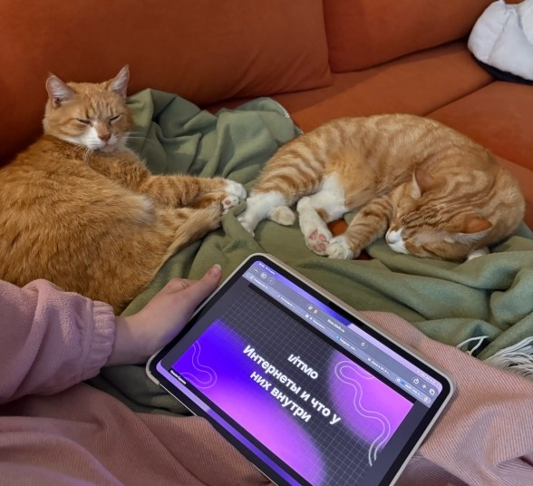

# О себе

Product Manager с опытом в growth и CRM. Работаю с метриками, формирую и проверяю гипотезы через A/B-тесты, запускаю инициативы по развитию клиентских механик и оптимизации пользовательских путей. Имею опыт работы с кросс-функциональными командами и аналитикой данных.

## Образование

| Годы | Учебное заведение | Программа |
|------|-------------------|-----------|
| 2025 – 2027 | Национальный исследовательский университет ИТМО (магистратура) | Управление высокотехнологичным бизнесом |
| 2018 – 2022 | СПбГЭУ (бакалавриат) | Экономика — математические методы и статистический анализ |

## Опыт работы

**CRM-маркетолог программы лояльности** — divan.ru (февраль 2025 — настоящее время)

- Развиваю программу лояльности и управляю ключевыми метриками
- Формирую и приоритизирую бэклог гипотез на основе данных и бизнес-целей
- Тестирую гипотезы и провожу A/B-тесты, внедряя успешные решения
- Управляю инициативами по улучшению клиентских механик от идеи до запуска
- Координирую работу кросс-функциональных команд (маркетинг, аналитика, IT)

**CRM-аналитик** — LOVE REPUBLIC (январь 2024 — февраль 2025)

- Разработала RFM-сегментацию с нуля и внедрила её в работу
- Автоматизировала систему отчётности и выстроила регулярный мониторинг метрик
- Подготавливала аналитические выводы и рекомендации для бизнеса

**Marketing & Revenue Operations Analyst** — ThriveDX (ноябрь 2022 — июнь 2023)

- Взаимодействовала с командами Sales, Marketing, Finance и Operations
- Поддерживала качество данных в CRM, обеспечивая корректность аналитики

**Специалист проектного финансирования** — ДОМ.РФ (июнь 2022 — август 2022)

- Победитель конкурса ПРОЕКТ.Ф — программа развития в проектном финансировании
- Участвовала в сопровождении кредитных сделок и анализе документации

## Навыки

| | | |
|---|---|---|
| CustDev | User Experience | Анализ данных |
| A/B тесты | Сегментация пользователей | Customer Journey Map |

## Хобби и увлечения

А ещё в свободное время меня отвлекают от продуктовых метрик два главных стейкхолдера — мои коты, Зюзя и Рыжик 🐾

