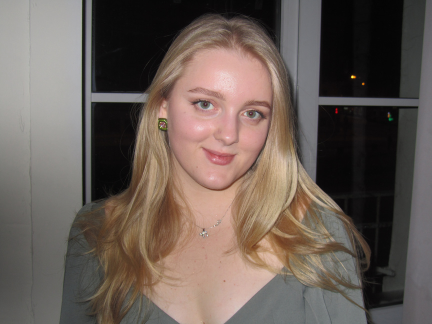

# Привет, я Мария Левина 👋

## Product Manager с фокусом на growth и CRM

Работаю с метриками (CTR, ARPU, Retention, LTV, NPS/CSI), формирую и проверяю гипотезы через A/B-тесты, запускаю инициативы по развитию клиентских механик и оптимизации пользовательских путей.

## Чем занимаюсь

- Развиваю программу лояльности и управляю ключевыми метриками
- Формирую и приоритизирую бэклог гипотез на основе данных и бизнес-целей
- Тестирую гипотезы и провожу A/B-тесты, внедряя успешные решения
- Координирую работу кросс-функциональных команд (маркетинг, аналитика, IT)

> "Данные важны, но продукт делают люди — для людей."

Узнать больше обо мне можно на странице [О себе](about.md), а посмотреть кейсы — на странице [Проекты](projects.md).

