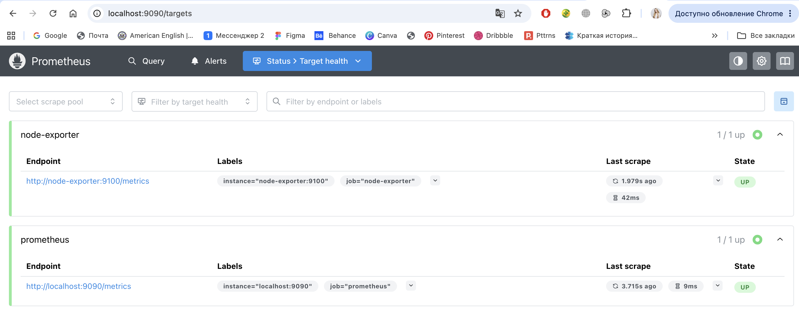
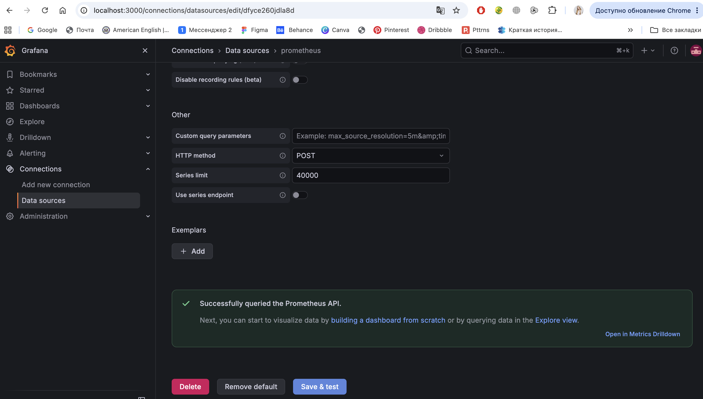
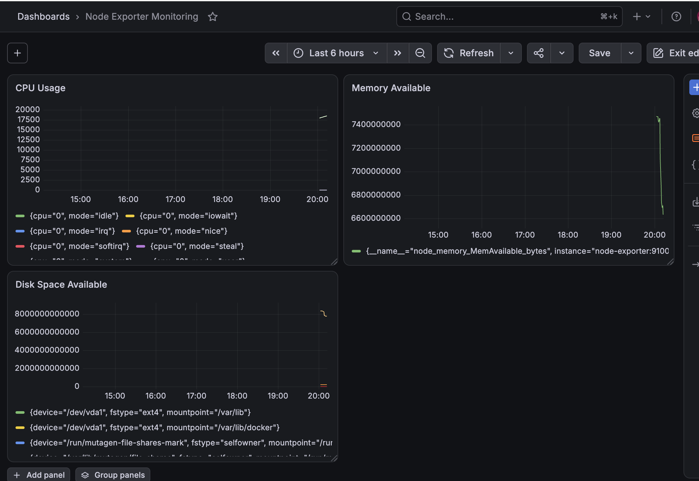
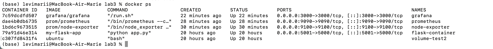

# Отчет по лабораторной работе №3

**Университет:** ИТМО, факультет ПИКТ
**Курс:** Введение в веб-технологии
**Учебный год:** 2026-2027
**Группа:** ВвВТ УВБ 3.1
**ФИО:** Мария Леви
**Дата начала работы:** 14.09.2026
**Дата защиты:** _______________

## Цель работы
Научиться настраивать локальную систему мониторинга, собирать метрики с помощью Prometheus и создавать дашборды в Grafana для визуализации данных.

## Ход выполнения работы

### 1. Подготовка конфигурации Prometheus
В папке `lab3/` создана подпапка `prometheus/`, в ней файл `prometheus.yml` с настройками сбора метрик: интервал скрейпа 15 секунд, два джоба — `prometheus` (сам себя, `localhost:9090`) и `node-exporter` (`node-exporter:9100`).

```yaml
global:
  scrape_interval: 15s

scrape_configs:
  - job_name: 'prometheus'
    static_configs:
      - targets: ['localhost:9090']

  - job_name: 'node-exporter'
    static_configs:
      - targets: ['node-exporter:9100']
```

### 2. Запуск Node Exporter
Контейнер Node Exporter запущен с проброшенным портом 9100 и смонтированными в режиме read-only `/proc`, `/sys` и `/` для сбора системных метрик. Работа проверена командой `curl http://localhost:9100/metrics` — эндпоинт отдаёт полный набор метрик (CPU, память, сеть, файловая система и т.д.) в формате Prometheus.

### 3. Запуск Prometheus
Создан том `prometheus-data` и сеть `monitoring` для связи контейнеров между собой по имени. Prometheus запущен с проброшенным портом 9090 и смонтированной папкой конфигурации.

**Возникшая проблема:** в методичке команда запуска Node Exporter не подключает его к сети `monitoring`, из-за чего Prometheus не смог бы обратиться к нему по имени `node-exporter`. Проблема решена дополнительной командой `docker network connect monitoring node-exporter` после создания сети — уже после этого оба таргета в Prometheus стали доступны.

Проверка: `http://localhost:9090` → Status → Targets — оба таргета (`prometheus` и `node-exporter`) в статусе UP.



### 4. Запуск Grafana
Создан том `grafana-data`, контейнер Grafana запущен в той же сети `monitoring` с проброшенным портом 3000 и заданным паролем администратора через переменную окружения `GF_SECURITY_ADMIN_PASSWORD`. Вход выполнен по адресу `http://localhost:3000` (admin/admin).

### 5. Настройка Grafana
Добавлен источник данных Prometheus (Connections → Data sources → Add data source → Prometheus, URL `http://prometheus:9090`). После Save & Test получено подтверждение успешного подключения — "Successfully queried the Prometheus API".



Создан дашборд "Node Exporter Monitoring" с тремя панелями:
- **CPU Usage** — метрика `node_cpu_seconds_total` (использование CPU по ядрам и режимам);
- **Memory Available** — метрика `node_memory_MemAvailable_bytes` (доступная память);
- **Disk Space Available** — метрика `node_filesystem_avail_bytes` (свободное место на файловых системах).

При добавлении третьей панели по невнимательности была повторно выбрана метрика памяти вместо дисковой — обнаружено при сверке легенды панели, исправлено заменой метрики на `node_filesystem_avail_bytes`.



### 6. Тестирование системы
Проверены все запущенные контейнеры командой `docker ps` — Node Exporter, Prometheus и Grafana в статусе Up, порты проброшены корректно.



Дашборд с тремя графиками (CPU, память, диск) отображает данные в реальном времени, обновляясь по интервалу скрейпа.

## Результат
- Настроена конфигурация Prometheus для сбора метрик с самого себя и с Node Exporter
- Запущен Node Exporter для сбора системных метрик хоста
- Запущен Prometheus, настроен сбор метрик по обоим таргетам
- Запущена Grafana, подключена к Prometheus как источнику данных
- Создан дашборд с тремя панелями для визуализации CPU, памяти и дискового пространства
- Решена практическая проблема с недостающим подключением Node Exporter к сети `monitoring`

## Использованные команды
```
docker run -d \
  --name node-exporter \
  --restart=unless-stopped \
  -p 9100:9100 \
  -v "/proc:/host/proc:ro" \
  -v "/sys:/host/sys:ro" \
  -v "/:/rootfs:ro" \
  prom/node-exporter \
  --path.procfs=/host/proc \
  --path.rootfs=/rootfs \
  --path.sysfs=/host/sys \
  --collector.filesystem.mount-points-exclude="^/(sys|proc|dev|host|etc)($$|/)"

curl http://localhost:9100/metrics

docker volume create prometheus-data
docker network create monitoring
docker network connect monitoring node-exporter

docker run -d \
  --name prometheus \
  --network monitoring \
  --restart=unless-stopped \
  -p 9090:9090 \
  -v prometheus-data:/prometheus \
  -v $(pwd)/prometheus:/etc/prometheus \
  prom/prometheus \
  --config.file=/etc/prometheus/prometheus.yml \
  --storage.tsdb.path=/prometheus \
  --web.console.libraries=/etc/prometheus/console_libraries \
  --web.console.templates=/etc/prometheus/consoles \
  --storage.tsdb.retention.time=200h \
  --web.enable-lifecycle

docker volume create grafana-data
docker run -d \
  --name grafana \
  --network monitoring \
  --restart=unless-stopped \
  -p 3000:3000 \
  -v grafana-data:/var/lib/grafana \
  -e "GF_SECURITY_ADMIN_PASSWORD=admin" \
  grafana/grafana

docker ps
```
